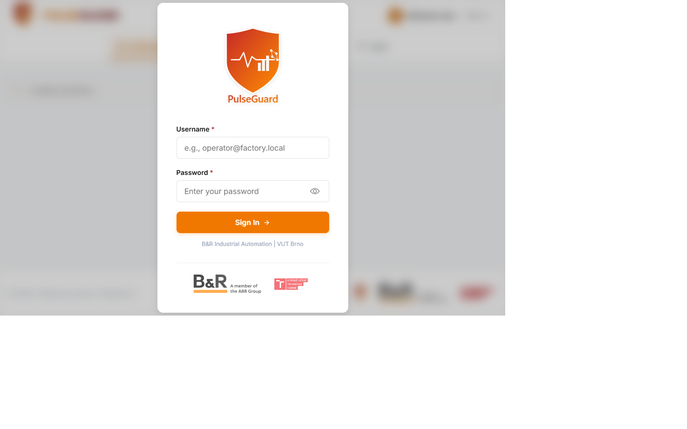
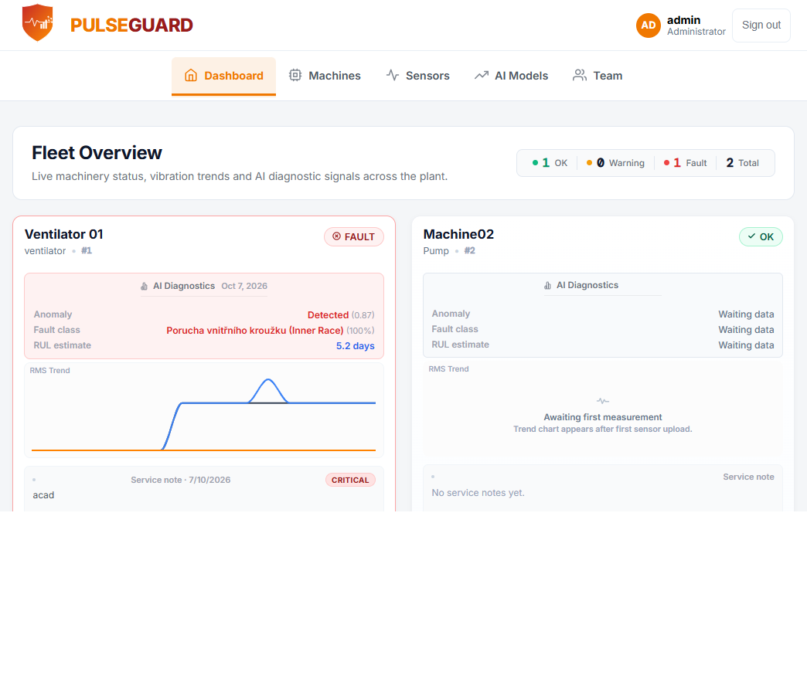
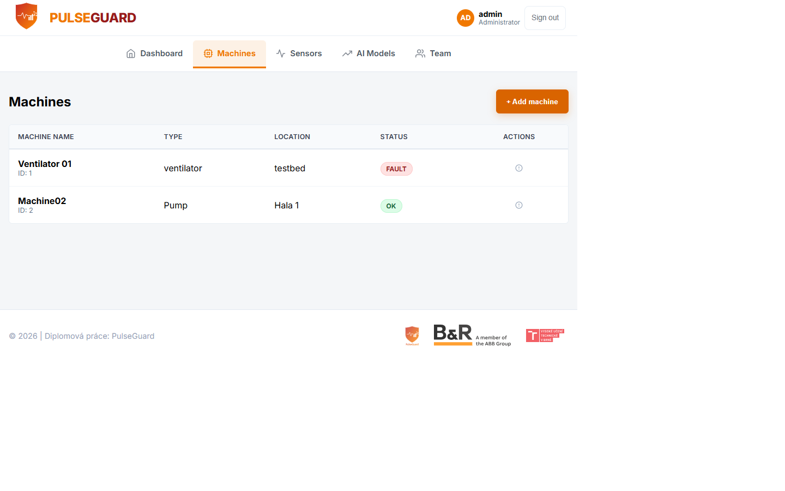
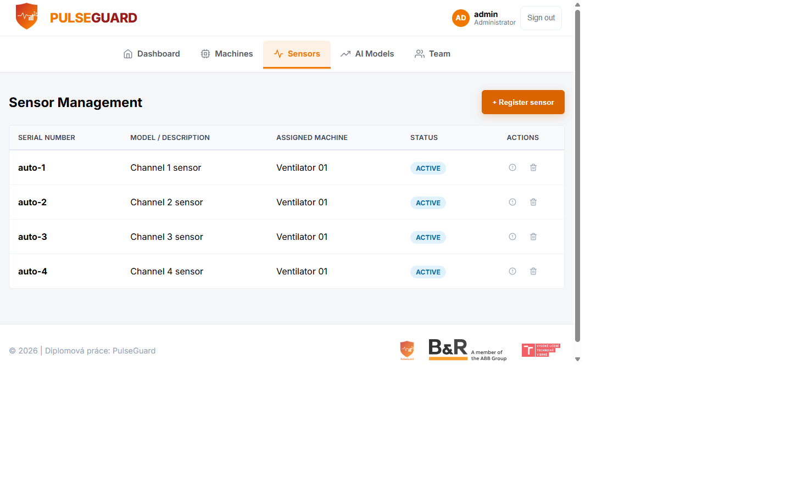
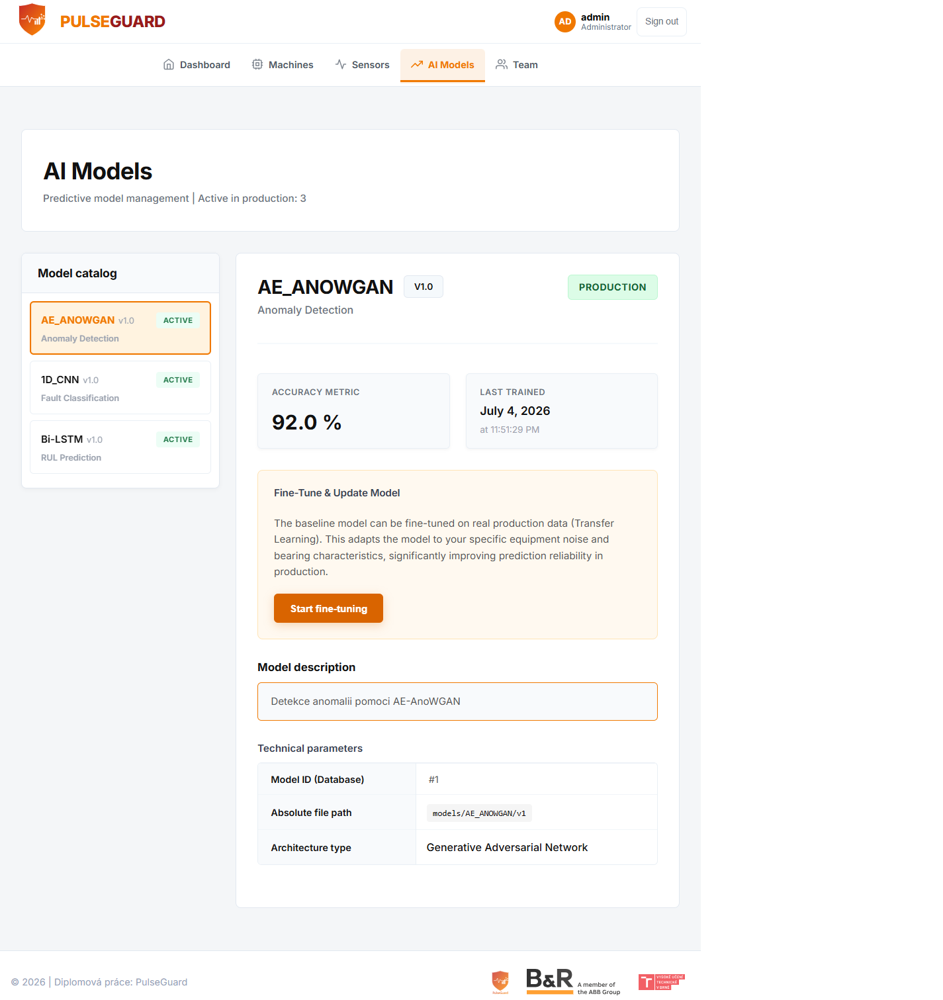
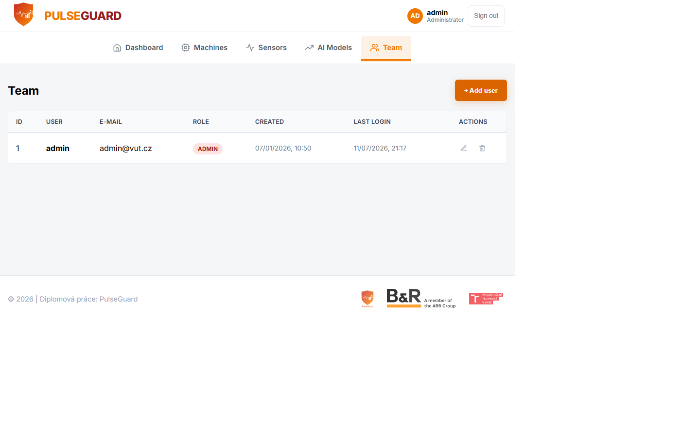

<!-- markdownlint-disable MD012 -->

# Vibro-diag System

Vibro-diag System is a containerized predictive maintenance platform for rotating machinery. It collects vibration data, applies machine-learning diagnostics, and presents maintenance insights in a web dashboard.

## What This Project Does

- Collects vibration data from industrial systems (including PLC-driven workflows)
- Stores measurements and analytics in TimescaleDB
- Runs anomaly detection, fault classification, and RUL estimation
- Provides a browser-based operations dashboard for diagnostics and maintenance notes

## Core Features

- Multi-service Docker deployment (frontend, backend, ML service, TimescaleDB)
- JWT-based authentication
- Machine/sensor management and service notes
- Automated and manual collection workflows
- Model catalog, fine-tuning triggers, and model activation flow

## System Components

| Service | Stack | Purpose | Default Port |
| --- | --- | --- | --- |
| Frontend | React + Vite + Nginx | Dashboard UI and API proxy | 80 |
| Backend | FastAPI + SQLAlchemy | Main API, auth, orchestration, PLC integration | 8000 |
| ML Service | FastAPI + PyTorch | Inference and asynchronous training tasks | 8001 |
| Database | PostgreSQL 15 + TimescaleDB | Relational and time-series storage | 5432 |

## Screenshots








## Architecture

High-level architecture and flows are documented in:

- [Architecture Overview](docs/architecture/overview.md)

## Quick Start (Docker)

```bash
git clone <repository-url>
cd Vibro-diag-system
docker compose up --build
```

Access:

- Frontend: <http://localhost>
- Backend API docs: <http://localhost:8000/docs>
- ML Service API docs: <http://localhost:8001/docs>

Stop:

```bash
docker compose down
```

Reset local data:

```bash
docker compose down -v
```

## Deployment and Operations

- [Installation Guide](docs/deployment/installation.md)
- [Customer Quick Start](docs/deployment/customer-quick-start.md)
- [Deployment Guide](docs/deployment/deployment-guide.md)
- [Configuration Reference](docs/deployment/configuration-reference.md)
- [Operations Guide](docs/operations/operations-guide.md)
- [Operator Runbook](docs/operations/operator-runbook.md)
- [Troubleshooting](docs/troubleshooting/troubleshooting.md)

## API and Data Documentation

- [Backend API](docs/api/backend-api.md)
- [ML Service API](docs/api/ml-service-api.md)
- [Database Schema](docs/database/schema.md)
- [ML Service Guide](docs/ml-service/overview.md)

## Development

- [Developer Guide](docs/development/developer-guide.md)
- Frontend design notes: [DESIGN.md](DESIGN.md)

## Security Notes

Review security findings before production deployment:

- [Security Audit Report](docs/operations/SECURITY_AUDIT_REPORT_2026-07-11.md)

## Documentation Audit

The full documentation audit and decisions are tracked in:

- [Documentation Audit Report](docs/DOCUMENTATION_AUDIT_REPORT.md)

## License

No explicit license file is present in the repository at the time of this documentation update.

