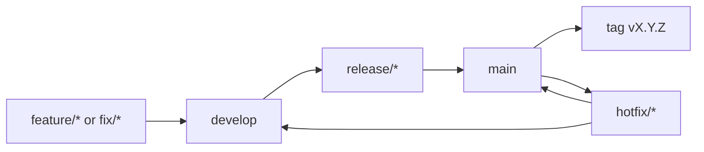

# Git Branching Draft for Effective Development and Maintenance

## 1) Goals
- Keep production stable at all times.
- Let frontend, backend, ML, and PLC work happen in parallel.
- Make releases predictable and hotfixes fast.
- Keep history clear for audit and rollback.

## 2) Recommended Model (GitFlow Lite)

### Long-lived branches
- main
  - Always production-ready.
  - Protected branch.
  - Merge only via Pull Request.
- develop
  - Integration branch for upcoming release.
  - Protected branch.
  - Merge feature/fix branches here first.

### Release branches
- release/<year>.<month>.<patch>
  - Created from develop when release prep starts.
  - Only bug fixes, docs, and release metadata changes.
  - After validation: merge into main and back into develop.

Example:
- release/2026.07.0

### Hotfix branches
- hotfix/<year>.<month>.<patch>
  - Created from main for urgent production issues.
  - After validation: merge into main and back into develop.

Example:
- hotfix/2026.07.1

## 3) Short-lived work branches

Use these prefixes:
- feature/<area>/<short-description>
- fix/<area>/<short-description>
- refactor/<area>/<short-description>
- chore/<area>/<short-description>
- docs/<short-description>
- spike/<area>/<short-description>
- security/<short-description>

Area suggestions for this repo:
- frontend
- backend
- ml
- plc
- infra
- data

Examples:
- feature/frontend/machine-detail-filters
- feature/backend/rbac-user-roles
- feature/ml/model-versioning-endpoint
- feature/plc/buffer-upload-retry
- fix/infra/docker-healthcheck-timeout
- docs/deployment-checklist

## 4) Branch Lifecycle

## 5) Merge and Commit Rules
- Use Pull Requests for all merges.
- Require at least 1 reviewer for feature/fix to develop.
- Require at least 2 reviewers for release/hotfix to main.
- Use squash merge for feature/fix branches.
- Use merge commit for release and hotfix branches to preserve release context.
- Delete branch after merge.

## 6) Protection Rules

For main:
- No direct push.
- Required status checks must pass:
  - frontend lint and build
  - backend tests
  - ml_service smoke tests
  - optional PLC integration checks (if available in CI)
- Require signed commits if team policy allows.
- Require linear history optional (recommended when using squash for features).

For develop:
- No force push.
- Required checks: lint, unit tests, and Docker build validation.

## 7) Versioning and Tags
- Use semantic tags on main:
  - vMAJOR.MINOR.PATCH
- Examples:
  - v1.4.0 for planned release
  - v1.4.1 for hotfix

## 8) Release Cadence Suggestion
- Weekly integration into develop.
- Bi-weekly or monthly release from develop to main.
- Emergency hotfix from main any time.

## 9) Practical Command Draft

Create develop once:
- git checkout -b develop
- git push -u origin develop

Start feature work:
- git checkout develop
- git pull
- git checkout -b feature/backend/add-device-alert-thresholds

Start release:
- git checkout develop
- git pull
- git checkout -b release/2026.07.0

Start hotfix:
- git checkout main
- git pull
- git checkout -b hotfix/2026.07.1

## 10) Optional Enhancements
- Add CODEOWNERS by area (frontend, backend, ml, plc).
- Enforce Conventional Commits for cleaner changelogs.
- Auto-generate release notes from merged PR labels.

## 11) Adoption Plan (Low Risk)
1. Create develop and protect it.
2. Apply branch naming convention.
3. Enable PR templates and minimum checks.
4. Use next release branch as pilot for this process.
5. Review after 2 release cycles and adjust.
