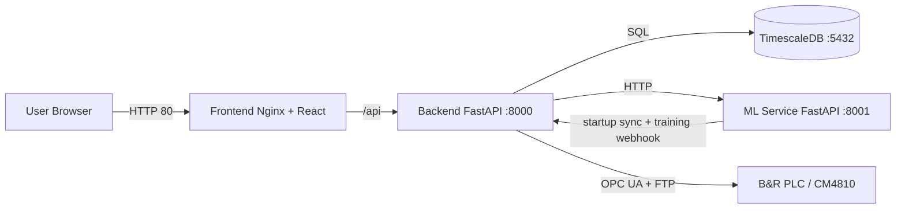
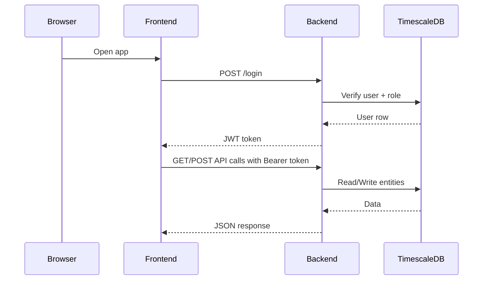
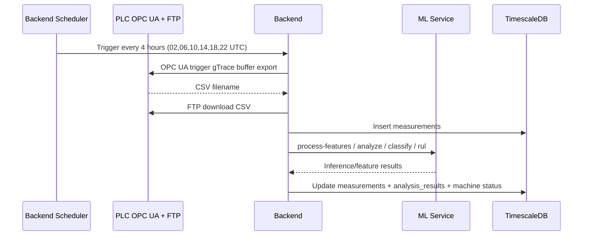

# Architecture Overview

## System Summary

Vibro-diag System is a containerized predictive maintenance platform for vibration diagnostics. It consists of four services:

- Frontend: React SPA served by Nginx
- Backend: FastAPI service that manages users, machines, sensors, measurements, and orchestration
- ML Service: FastAPI inference and training service with PyTorch models
- Database: PostgreSQL 15 with TimescaleDB extension

## Container Architecture

## Request Flow

## Authentication Flow

- Login endpoint: `POST /login`
- Token format: JWT bearer token
- Token refresh: `POST /auth/refresh`
- Frontend stores token in session storage and sends as `Authorization: Bearer <token>`

Notes:

- Authorization checks are role-dependent for some routes (`admin`, `operator`, `user`).
- Security hardening gaps are documented in [Security Audit Report](../operations/SECURITY_AUDIT_REPORT_2026-07-11.md).

## Data Collection and ML Flow

## Deployment Topology

- Default deployment is single-host Docker Compose.
- Frontend exposes port 80 to users.
- Backend exposes port 8000.
- ML Service exposes port 8001.
- Database exposes port 5432.
- Data persistence:
  - Database volume: `vibro-db-data`
  - Host-mounted raw and model folders for backend and ML services

See [Deployment Guide](../deployment/deployment-guide.md) and [Configuration Reference](../deployment/configuration-reference.md).
