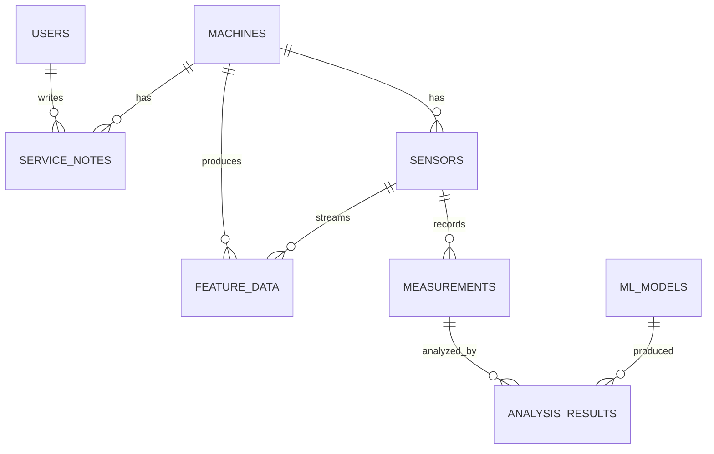

# Database Documentation

Database engine: PostgreSQL 15 + TimescaleDB extension

Schema bootstrap file: `init.sql`

## Main Tables

### users
- Purpose: application users and roles
- Key columns:
  - `id_user` PK
  - `username`, `email` unique
  - `hashed_password`
  - `role` enum: `admin`, `operator`, `user`
  - `creation_time`, `last_login`

### machines
- Purpose: monitored assets and collection connectivity settings
- Key columns:
  - `id_machine` PK
  - `name`, `type`, `location`, `status`
  - `opc_ua_url`
  - `ftp_host`, `ftp_user`, `ftp_password`, `ftp_dir`
  - `is_active_collection`

### sensors
- Purpose: physical sensors with assignment to machine
- Key columns:
  - `id_sensor` PK
  - `serial_number` unique
  - `status` enum: `available`, `maintenance`, `active`
  - `id_machine` FK -> machines
  - `position`, `sampling_rate`, `calibration_date`

### measurements (hypertable)
- Purpose: measurement-level records (raw path + extracted features)
- Partition column: `timestamp`
- Key columns:
  - composite PK (`id_measurement`, `timestamp`)
  - `id_sensor` FK -> sensors
  - `raw_data_path`
  - feature columns (`rms_raw`, `peak_raw`, `kurtosis_raw`, `rms_acl_env`, `dif_kt_raw`, `skewness_raw`, `act_speed`)

### feature_data (hypertable)
- Purpose: time-series feature stream (often from IIoT/OPC paths)
- Partition column: `time`
- Key columns:
  - composite PK (`id_featureset`, `time`)
  - `id_machine` FK -> machines
  - `id_sensor` FK -> sensors
  - feature columns similar to `measurements`

### analysis_results (hypertable)
- Purpose: ML predictions linked to measurements
- Partition column: `timestamp`
- Key columns:
  - composite PK (`id_analysis`, `timestamp`)
  - `id_model` FK -> ml_models
  - `id_measurement`
  - `prediction_type`, `prediction_value`, `prediction_label`, `confidence`

### ml_models
- Purpose: model catalog, versioning, activation, and training status
- Key columns:
  - `id_model` PK
  - `name`, `version`, `type`
  - `path_to_model`
  - `is_active`
  - `training_status` (`training`, `ready`, `failed`)

### service_notes
- Purpose: machine maintenance and operations notes
- Key columns:
  - `id_note` PK
  - `id_machine` FK -> machines
  - `id_user` FK -> users
  - `severity` enum: `INFO`, `WARNING`, `CRITICAL`
  - `content`, `timestamp`

### iiot_buffer
- Purpose: raw JSON staging from IIoT connector for trigger-based transformation into `feature_data`

## TimescaleDB Usage

The following tables are converted to hypertables:

- `measurements` on `timestamp`
- `feature_data` on `time`
- `analysis_results` on `timestamp`

## Trigger and Stored Procedure

- Function: `process_iiot_json()`
- Trigger: `trg_iiot_to_timescale` on `iiot_buffer`

Behavior:
- Parses incoming JSON from `iiot_buffer.data`
- Extracts signal values by node and sensor
- Inserts transformed values into `feature_data`
- Deletes processed row from `iiot_buffer`

## Relationships

## Indexes and Retention

- Explicit custom indexes beyond primary keys are not defined in `init.sql`.
- Automatic retention/compression policies are not defined in `init.sql`.

If long-term operation is required, add retention and index strategy as a future migration task.

## Migration Strategy (Current State)

- Current repository uses one bootstrap SQL script (`init.sql`) for initial schema.
- No separate versioned migration framework is present.

Recommendation:
- Introduce migration tooling (for example Alembic/Flyway) for production lifecycle upgrades.

## Related Docs

- [Deployment Guide](../deployment/deployment-guide.md)
- [Operations Guide](../operations/operations-guide.md)
- [Backend API](../api/backend-api.md)
