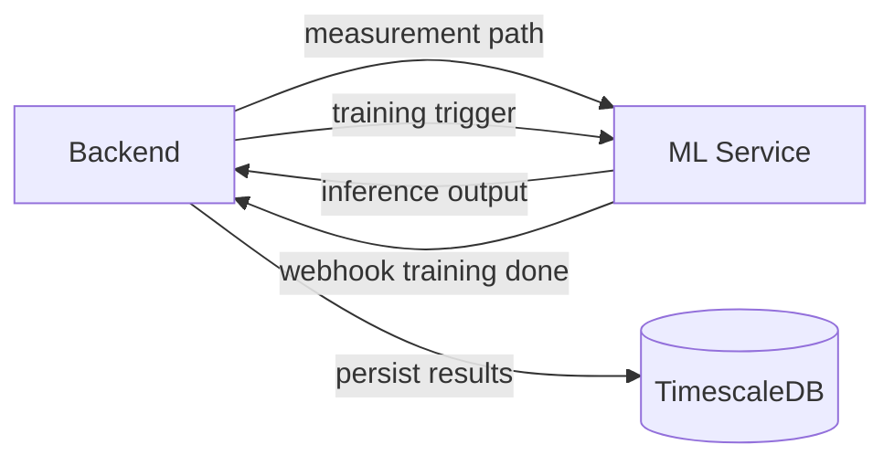

# ML Service Documentation

## Purpose

The ML service provides model inference and asynchronous model fine-tuning for vibration diagnostics.

Primary capabilities:

- Anomaly detection (AE-AnoWGAN)
- Fault classification (1D-CNN)
- Remaining useful life prediction (Bi-LSTM)
- Signal preprocessing and visualization support (raw, FFT, CWT)

## Inputs and Outputs

### Inputs

- Measurement CSV file paths (for anomaly/classification/preprocessing)
- Sequence feature vectors (for RUL)
- Training payloads from backend for fine-tuning

### Outputs

- Anomaly score and flag
- Fault label and confidence
- RUL fraction (backend maps to days)
- Feature extraction JSON
- FFT arrays and CWT image output for UI visualization

## Supported Models and Paths

The backend controls active model selection through `ml_models` table.

At ML service startup:
- Calls backend `POST /models/sync-active`
- Loads active model files into memory

Models loaded:
- AE-AnoWGAN: encoder/decoder/discriminator trio
- 1D-CNN: single `.pth` file
- Bi-LSTM: category models (`OR`, `IR`, `O`) where available

## Data Flow

## Fine-Tuning Workflow

1. Backend receives fine-tune request (`POST /models/{id}/fine-tune`).
2. Backend creates new model row with `training_status='training'`.
3. Backend invokes one of ML trigger endpoints.
4. ML service runs background training function.
5. ML service calls backend webhook on completion.
6. Backend sets status to `ready` or `failed`.
7. Operator activates selected model version.

## Retraining and Operational Notes

- Training scripts are in:
  - `ml_service/train_aeanowgan.py`
  - `ml_service/train_1dcnn.py`
  - `ml_service/train_rul.py`
- Bulk helper scripts include:
  - `ml_service/import_batch.py`
  - `ml_service/split_senzor_data.py`

## Limitations

- Direct path-based API design requires careful network and input controls.
- No built-in model registry with signatures/checksums in current implementation.
- No dedicated experiment tracking store in current implementation.

## Related Docs

- [ML Service API](../api/ml-service-api.md)
- [Backend API](../api/backend-api.md)
- [Training legacy notes](../archive/legacy/MODEL_TRAINING_legacy.md)
